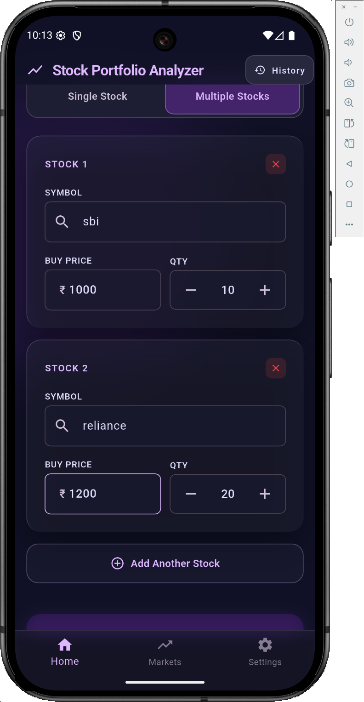
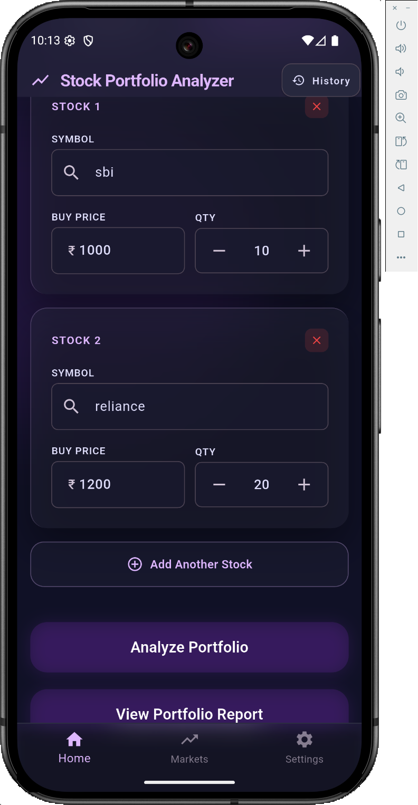
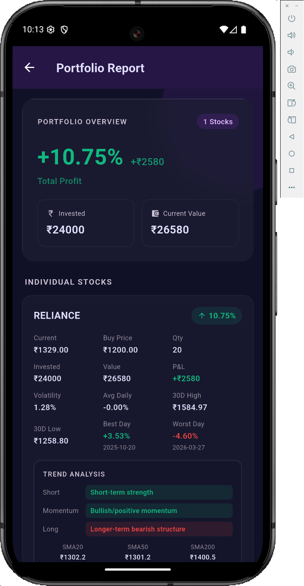
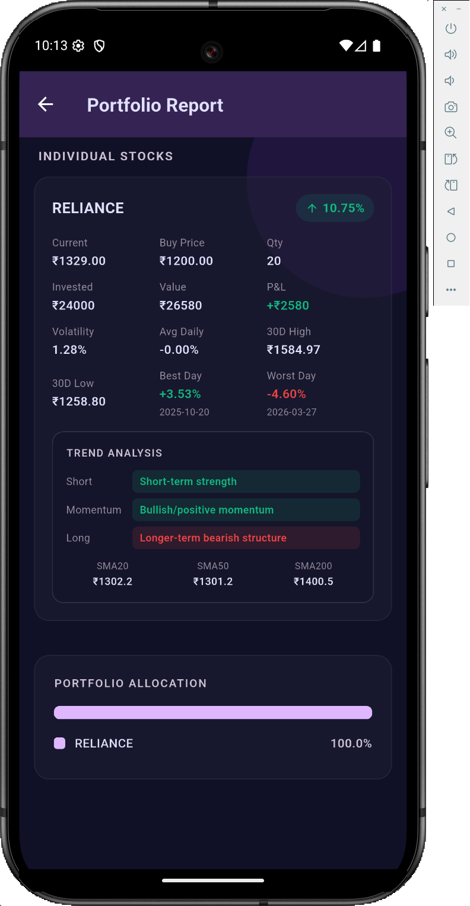

# Stock Portfolio Analyzer 📊

A full-stack stock portfolio tracking and analysis app built with **Python (FastAPI)** backend and **Flutter** frontend. Enter your stocks, buy price, and quantity — get a complete portfolio report with trend analysis, volatility, P&L, and SMA indicators.

## 📱 Screenshots

<table>
  <tr>
    <td width="50%"></td>
    <td width="50%"></td>
  </tr>
  <tr>
    <td align="center">Single & Multi Stock Input</td>
    <td align="center">Analyze Portfolio</td>
  </tr>
  <tr>
    <td width="50%"></td>
    <td width="50%"></td>
  </tr>
  <tr>
    <td align="center">Portfolio Overview & P&L</td>
    <td align="center">Trend Analysis & Allocation</td>
  </tr>
</table>

## ✨ Features

- **Single & Multi-Stock Analysis** — Analyze one stock or an entire portfolio at once
- **Portfolio Overview** — Total invested, current value, overall P&L and P&L percentage
- **Per-Stock Metrics** — Current price, buy price, quantity, invested amount, current value
- **Volatility & Daily Returns** — Daily return percentage, average daily return, and volatility score
- **30D High / Low** — 52-week range tracking per stock
- **Best & Worst Day** — Best and worst single-day return with exact dates
- **SMA Trend Analysis** — SMA20, SMA50, SMA200 with short-term, momentum, and long-term trend labels
- **Portfolio Allocation** — Visual weight breakdown of each stock in your portfolio
- **History** — View past analysis results

## 🛠 Tech Stack

| Layer | Technology |
|-------|-----------|
| Backend | Python, FastAPI, yFinance, Pandas, NumPy |
| Frontend | Flutter, Dart, Dio, Provider |
| API | REST (HTTP/JSON) |

## 🚀 Getting Started

### Backend

```bash
cd backend
pip install -r requirements.txt
uvicorn app:app --reload --host 0.0.0.0 --port 8000
```

### Frontend

```bash
cd frontend
flutter pub get
flutter run
```

> Update the `baseUrl` in `lib/services/api_service.dart` to your machine's local IP.

## 📡 API Endpoints

| Method | Endpoint | Description |
|--------|----------|-------------|
| `GET` | `/` | Health check |
| `POST` | `/analyze/single-stock` | Analyze a single stock |
| `POST` | `/analyze/multiple-stock` | Analyze multiple stocks |
| `POST` | `/api/refresh-prices` | Refresh live prices |

### Request Example

```json
POST /analyze/single-stock
{
  "stockname": "RELIANCE.NS",
  "price": 1200.0,
  "quantity": 20
}
```

## 📊 Response Fields

- `Current Price`, `Bought Price`, `Quantity`
- `Profit Loss`, `Profit Loss Percentage`
- `Total Investment Amount`, `Current Portfolio Value`
- `Volatility`, `Daily Returns`
- `Best Day` / `Worst Day` (date + return %)
- `30D High` / `30D Low`
- `SMA20`, `SMA50`, `SMA200`
- `Short Term`, `Momentum`, `Long Term` trend labels
- `Portfolio Weight` (multi-stock only)

## 📄 License

MIT License — open source and free to use.

---

Built with ❤️ using Flutter & Python
